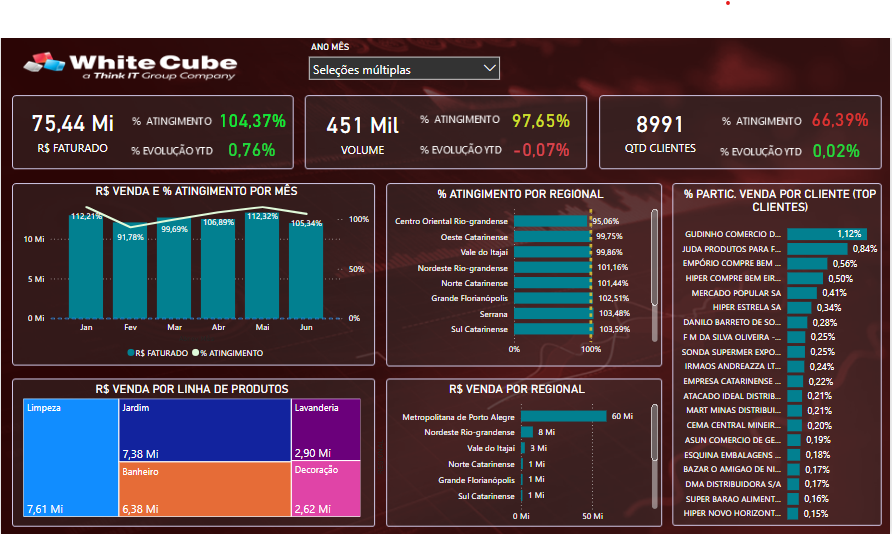

# 📊 Dashboard de Vendas – Power BI

Este repositório contém um dashboard desenvolvido no Power BI, utilizando dados fictícios de vendas para análise visual e insights de performance.

---

## 📷 Visual do Dashboard

---

## 📁 Arquivos

- `DASHBOARD DE VENDAS.pbix`: arquivo editável do Power BI
- `dashboard.png`: imagem de visualização do dashboard

---

## 🧠 Tecnologias utilizadas

- Power BI
- Modelagem de dados
- Métricas DAX
- Visualização de dados

